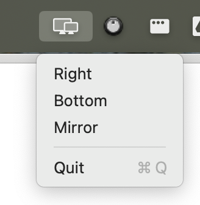

# Display Layout Toolbar Switcher

A macOS menu bar utility to manage external display configurations using [displayplacer](https://github.com/jakehilborn/displayplacer).




## Features

- Quick access to common display layouts: Right, Bottom, and Mirror
- Automatic display detection
- Menu bar integration

## Prerequisites

- macOS 10.10+
- [Homebrew](https://brew.sh)

## Installation

```bash
# Clone and install
git clone [repository-url]
cd display-layout-switcher
make install

# Start the app
open /Applications/DisplayLayout.app
```

Enable Start at Login

1. System Settings → General → Login Items
2. Click + button
3. Navigate to /Applications/DisplayLayout.app
4. Click Open

## Development

```
make         # Build the app
make install # Install to /Applications and scripts
```

## License

MIT